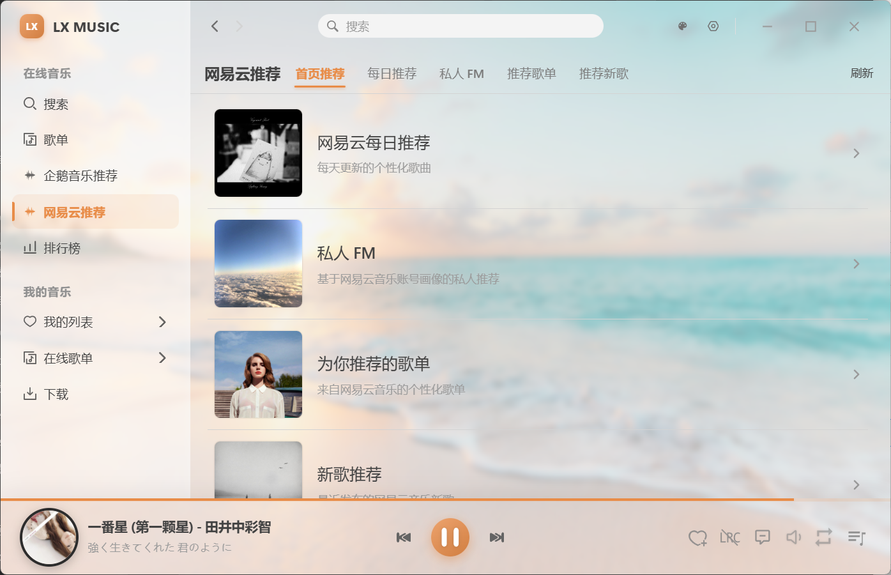

<h1 align="center">LX Flow Music</h1>

  
  

<!-- [![GitHub release][1]][2]
[![Build status][3]][4]
[![GitHub Releases Download][5]][6]
[![dev branch][7]][8]
[![GitHub license][9]][10] -->

<!-- [1]: https://img.shields.io/github/release/lyswhut/lx-music-desktop
[2]: https://github.com/lyswhut/lx-music-desktop/releases
[3]: https://ci.appveyor.com/api/projects/status/flrsqd5ymp8fnte5?svg=true
[4]: https://ci.appveyor.com/project/lyswhut/lx-music-desktop
[5]: https://img.shields.io/github/downloads/lyswhut/lx-music-desktop/latest/total
[5]: https://img.shields.io/github/downloads/lyswhut/lx-music-desktop/total
[6]: https://github.com/lyswhut/lx-music-desktop/releases
[7]: https://img.shields.io/github/package-json/v/lyswhut/lx-music-desktop/dev
[8]: https://github.com/lyswhut/lx-music-desktop/tree/dev
[9]: https://img.shields.io/github/license/lyswhut/lx-music-desktop
[10]: https://github.com/lyswhut/lx-music-desktop/blob/master/LICENSE -->

基于 LX Music Desktop 的个人使用修改版，专注于 QQ 音乐个性化推荐。

## 个人使用版说明

这是我基于 [LX Music Desktop](https://github.com/lyswhut/lx-music-desktop) 修改维护的个人使用版，并非原项目官方发行版。原项目的版权、许可和署名均保留在本仓库中；本项目同样遵循 Apache License 2.0。

原项目：<https://github.com/lyswhut/lx-music-desktop>

## 我增加和调整的功能

- 新增 QQ 音乐每日推荐入口：在左侧导航中可直接打开，不需要手动进入 QQ 音乐的深层歌单页面。
- 新增四类 QQ 音乐推荐视图：主页推荐、雷达推荐、推荐歌单、推荐新歌。
- 新增独立的 QQ 音乐设置页：可通过登录窗口获取登录状态，不必手动粘贴 Cookie；登录信息只保存于本机应用数据中。
- 推荐依据使用 QQ 音乐账号的播放记录和歌单等数据，结合 QQ 音乐的推荐结果。
- Windows Setup 安装版支持通过 GitHub Releases 在软件内检查、下载和安装后续更新。

## 下载与更新

请从 [GitHub Releases](https://github.com/eohh-zhou/lx-flow-music-desktop/releases) 下载 Windows x64 版本。

| 包类型 | 文件名示例 | 适用场景 |
| --- | --- | --- |
| Setup 安装版 | `LXFlowMusic-v2.12.6-x64-Setup.exe` | 推荐。安装后可在软件内完成后续更新。 |
| 绿色免安装版 | `LXFlowMusic-v2.12.6-win_x64-green.7z` | 解压后直接运行 `LXFlowMusic.exe`。不支持自动安装更新。 |

从绿色版迁移到支持自动更新的版本时，只需安装一次 Setup 安装版。

## 用户界面

